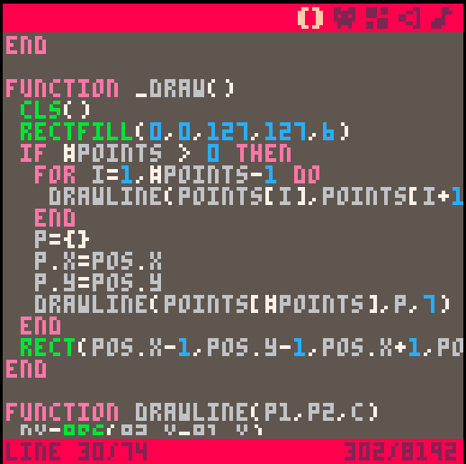
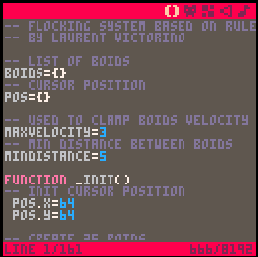
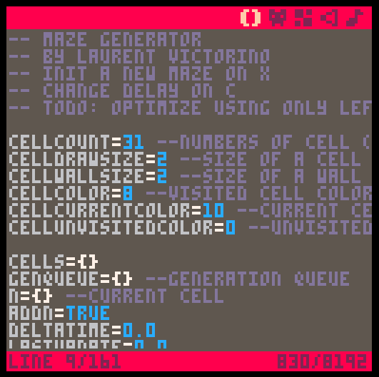
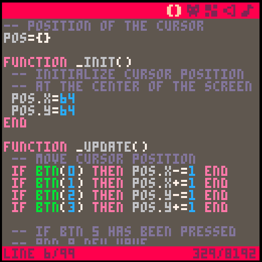
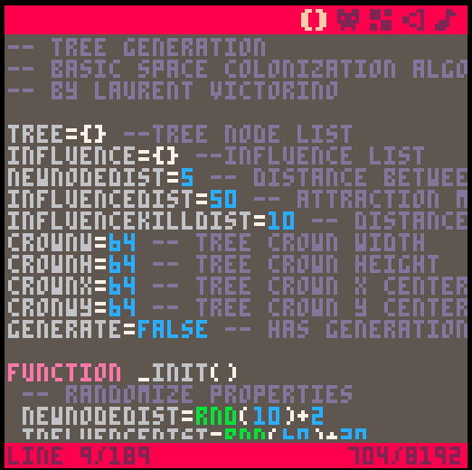

# Pico-8 experiments
Repository containing some of my Pico-8 experiments.

##[Bresenham's line algorithm](bresenham.p8)

##[Flocking system](flock.p8)

##[Maze generator](mazegen.p8)

##[Mid point circle algorithm](midpointcircle.p8)

##[Space colonization algorithm](treegen.p8)

